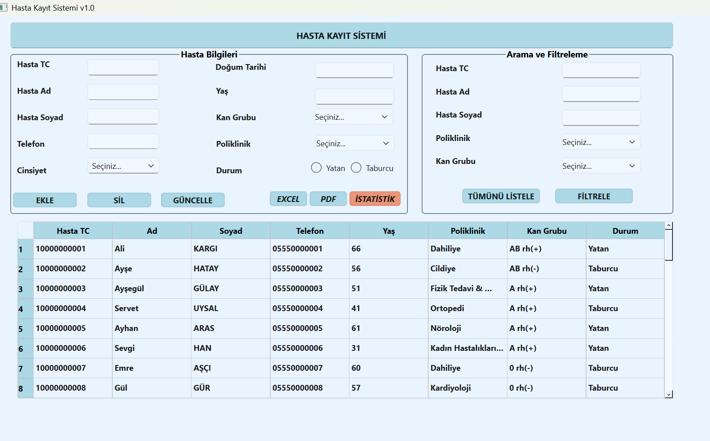
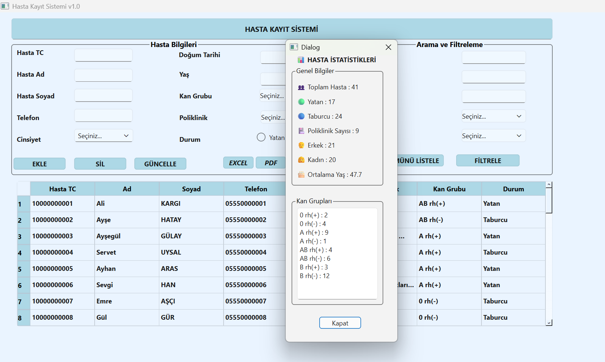
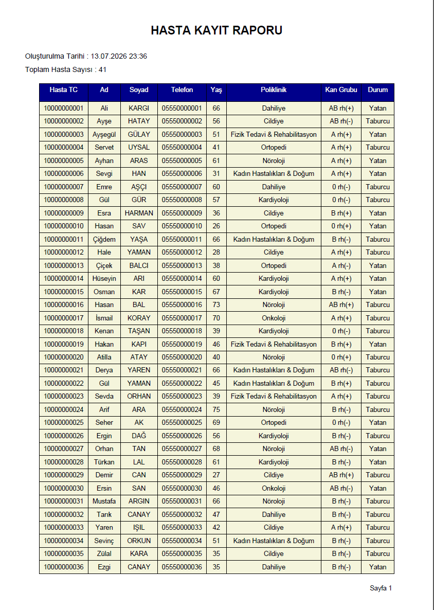

# Patient Registration System

A desktop-based patient registration and management application developed with **Python, PyQt6, and SQLite**.

This project was developed as a final project for a Python programming course. It demonstrates desktop GUI development, database operations, data filtering, reporting, and file export functionality.

> **Note:** All patient data used in this project is synthetic and created for demonstration purposes. No real patient or personal data is included.

## Demo


## Screenshots

### Main Application


### Patient Statistics


### PDF Report


## Features

- Add new patient records
- Update existing patient information
- Delete patient records
- List all patients
- Search patients by ID number
- Filter patient records
- Automatic age calculation based on date of birth
- Patient status management
- Export patient records to Excel
- Generate PDF reports
- Display patient statistics
- SQLite database integration
- Desktop executable support

## Technologies Used

- Python
- PyQt6
- Qt Designer
- SQLite
- OpenPyXL
- ReportLab
- PyInstaller

## Application Interface

The current user interface is available in **Turkish**.

The project documentation is provided in English to make the application and its technical structure accessible to international developers and recruiters.

## Project Structure

```text
patient-registration-system/
│
├── main.py
├── hastakayit.py
├── hastakayit.ui
├── istatistik.py
├── istatistik.ui
├── hastabilgi.db
├── cevirme_hastakayit.py
├── cevirme_istatistik.py
├── registration.ico
├── patient-registration-system-demo.gif
├── README.md
├── .gitignore
└── LICENSE
```

## Installation

Clone the repository:

```bash
git clone https://github.com/juleuzun/patient-registration-system.git
```

Navigate to the project directory:

```bash
cd patient-registration-system
```

Install the required libraries:

```bash
pip install PyQt6 openpyxl reportlab
```

Run the application:

```bash
python main.py
```

## Database

The application uses **SQLite** for local data storage.

The included database contains synthetic patient records created exclusively for testing and demonstration purposes.

## Export and Reporting

Patient records can be exported to:

- Excel (`.xlsx`)
- PDF (`.pdf`)

PDF reports include the report creation date, total patient count, tabular patient data, and page numbering.

## Executable

The application can be packaged as a Windows executable using **PyInstaller**.

The executable version was built using the `onedir` distribution mode.

## Purpose

The purpose of this project is to demonstrate practical skills in:

- Python desktop application development
- GUI design with PyQt6 and Qt Designer
- SQLite database integration
- CRUD operations
- Data filtering and searching
- Excel export
- PDF report generation
- Desktop application packaging

## License

This project is licensed under the MIT License.
